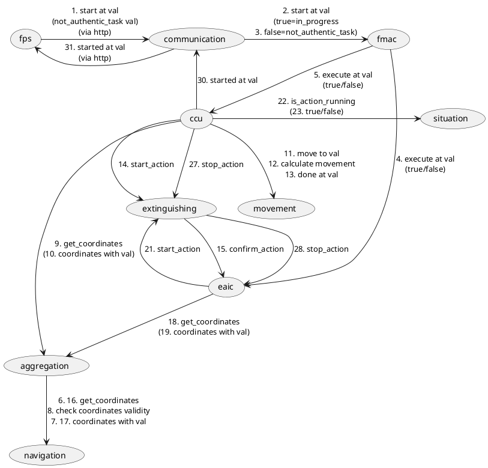
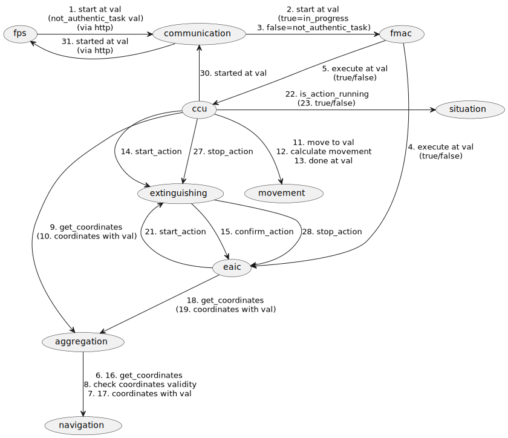

# Developer notes

- [Terms and progress](#terms-and-progress)
- [Communications](#communications)
- [Protocol](#Protocol)
- [Logic](#logic-from-plantuml)
- [Logic with pseudocode](#logic-with-pseudocode)
- [Dev Plan log](#dev-plan-log)

## Terms and progress:
- [ ] FPS (Flight Plan Server) - Источник полётного задания
- [ ] Communication - Связь
- [ ] FMAC (Flight mission authenticity control) - Контроль аутентичности полётного задания
- [ ] EAIC (extinguishing and ignition circuits controller) - Контроль активации цепей тушения и поджига
- [ ] CCU (Central control unit) - Центральная система управления
- [ ] Aggregation - Комплексирование
- [ ] Navigation system - Навигация GNSS + ИНС
- [ ] Movement control - Управление перемещением
- [ ] Situation control - Контроль обстановки
- [ ] Extinguishing - Процедура тушения

## Interface
 - FPS is listening on 8081 port, so accessible via http://localhost:8081

## Communications:
 - all modules have queues
   - send requests go into monitor queue
 - monitor module logic
   - subscribes to monitor
   - gets { src, dst, cmd }
   - checks if allowed
   - publish to name
 
## Protocol (used in mosquitto messages):
  - simple csv
  - from,to,method[,param1,param2]

### Interconnection and allowed communications



## Logic (from plantuml):
```
fps -> communication
  1. start extinguishing at A
communication -> fmac
  2. start extinguishing at A
fmac
  3. Authentic task check
fmac -> eaic
  4. execute extinguishing at A
fmac -> ccu
  5. execute extinguishing at A
aggregation -> navigation
  6. get coordinates
navigation -> aggregation
  7. return coordinates
aggregation
  8. check coordinates validity
ccu -> aggregation
  9. get coordinates
aggregation -> ccu
 10. coordinates
ccu -> movement
 11. move to A
movement
 12. calculate movement
movement -> ccu
 13. move to A done
ccu -> extinguishing
 14. start extinguish/fire
extinguishing -> eaic
 15. extinguishing request
aggregation -> navigation
 16. get coordinates
navigation -> aggregation
 17. return coordinates
eaic -> aggregation
 18. get coordinates
aggregation -> eaic
 19. coordinates and time
eaic
 20. check if extinguishing/fire at this place (A) is allowed
eaic -> extinguishing
 21. activate extinguishing/fire
extinguishing
 22. proceed extinguishing/fire
eaic
 23. position control
ccu -> situation
 24. check if algo is running
situation
 25. check if extinguishing is running
situation -> ccu
 26. extinguishing is running
ccu -> extinguishing
 27. stop algo extinguishing
extinguishing -> eaic
 28. stop
eaic
 29. disable extinguishing/fire
ccu -> communication
 30. extinguishing/fire at A has been started
communication -> fps
 31. extinguishing/fire at A has been started
```

## Logic with pseudocode:
### [ ] FPS (Flight Plan Server) - Источник полётного задания
```
fps -> communication
pub  1. start extinguishing at A
communication -> fps
sub 31. extinguishing/fire at A has been started
```
```
listen // for commands and an interchange data with the communication
    if started at val
        send client started at val // via web interface
    if start at val
        send communication start at val
    if not_authentic_task at val
        send client not_authentic_task at val
```

### [ ] Communication - Связь
```
fps -> communication
- sub  1. start extinguishing at A
communication -> fmac
- pub  2. start extinguishing at A
ccu -> communication
- sub 30. extinguishing/fire at A has been started
communication -> fps
- pub 31. extinguishing/fire at A has been started
```
```
listen
    if start at val
        pub fmac start at var
sub communication
    if started at var:
        send fps started at var
    if not_authentic_task at var:
        send fps not_authentic_task at var
```

### [ ] FMAC (Flight mission authenticity control) - Контроль аутентичности полётного задания
```
communication -> fmac
- sub  2. start extinguishing at A
fmac
- private  3. Authentic task check
fmac -> eaic
- pub  4. execute extinguishing at A
fmac -> ccu
- pub  5. execute extinguishing at A
```
```
sub fmac
    if start at var:
        if(authentic_task_check(var))
            pub eaic execute at var
            pub ccu execute at var
```
### [ ] EAIC (extinguishing and ignition circuits controller) - Контроль активации цепей тушения и поджига
```
fmac -> eaic
- sub  4. execute extinguishing at A
extinguishing -> eaic
- sub 15. extinguishing request
eaic -> aggregation
- pub 18. get coordinates
aggregation -> eaic
- sub 19. coordinates and time
eaic
- private 20. check if extinguishing/fire at this place (A) is allowed
eaic -> extinguishing
- pub 21. activate extinguishing/fire
eaic
- private 23. position control
extinguishing -> eaic
- sub 28. stop
eaic
- private 29. disable extinguishing/fire
```
```
sub eaic
    execute_action at var // 4
        task = var
    action_request // 15
        pub aggregation get_coordinates // 18
    coordinates
        action_is_allowed at task // 20
        pub extinguishing start_action //21
        position_control // 23
    stop_action // 28
        task="" // 29
```

### [ ] CCU (Central control unit) - Центральная система управления
```
fmac -> ccu
- sub  5. execute extinguishing at A
ccu -> aggregation
- pub  9. get coordinates
aggregation -> ccu
- sub 10. coordinates
ccu -> movement
- pub 11. move to A
movement -> ccu
- sub 13. move to A done
ccu -> extinguishing
- pub 14. start extinguish/fire
ccu -> situation
- pub 24. check if algo is running
situation -> ccu
- sub 26. extinguishing is running
ccu -> extinguishing
- pub 27. stop algo extinguishing
ccu -> communication
- pub 30. extinguishing/fire at A has been started
```
```
sub ccu:
    if start_action at A // 5
        pub aggregation get_coordinates // 9
    if coordinates //10
        pub movement move to A // 11
    if done_movement at A // 13
        pub extinguishing start_action // 14 extinguish/fire
    if action_is_running // 26
        pub extinguishing stop_action // 27
        pub communication started at A // 30
loop:
    pub situation is_action_in_progress // 24

```

### [ ] Aggregation - Комплексирование
```
aggregation -> navigation
- pub  6. get coordinates
navigation -> aggregation
- sub  7. return coordinates
aggregation
- pub  8. check coordinates validity
ccu -> aggregation
- sub  9. get_coordinates
aggregation -> ccu
- pub 10. coordinates
aggregation -> navigation
- pub 16. get coordinates
navigation -> aggregation
- sub 17. return coordinates
eaic -> aggregation
- sub 18. get coordinates
aggregation -> eaic
- pub 19. coordinates and time
```
```
export aggregation get_coordinates
        return coordinates{var_gps, var_ins}
loop:
    request navigation get_coordinates
    response (var_gps, var_ins)
        check_coordinates_validity(var_gps, var_ins)
        save coordinates{var_gps, var_ins}
```

### [ ] Navigation system - Навигация GNSS + ИНС
```
aggregation -> navigation
- sub 6. get_coordinates
navigation -> aggregation
- pub  7. return coordinates
aggregation -> navigation
- sub 16. get_coordinates
navigation -> aggregation
- pub 17. return coordinates
```
```
export navigation get_coordinates:
    return coordinates{var_gps, var_ins}
```

### [ ] Movement control - Управление перемещением
```
ccu -> movement
- sub 11. move to A
movement
- private 12. calculate movement
movement -> ccu
- pub 13. move to A done
```
```
export movement move_to(val):
    calculate_movement(val)
    return true
```

### [ ] Situation control - Контроль обстановки
```
ccu -> situation
 24. check if algo is running
situation
 25. check if extinguishing is running
situation -> ccu
 26. extinguishing is running
ccu -> situation
```
```
sub situation
  if is_action_running
      pub from state.action_in_progress
```
### [ ] Extinguishing - Процедура тушения
```
ccu -> extinguishing
- sub 14. start extinguish/fire
extinguishing -> eaic
- pub 15. extinguishing request
eaic -> extinguishing
- sub 21. activate extinguishing/fire
extinguishing
- private 22. proceed extinguishing/fire
ccu -> extinguishing
- sub 27. stop algo extinguishing
extinguishing -> eaic
- pub 28. stop
```
```
sub extinguishing
    action
        pub eaic action
    start_action
        proceed_action()
    stop_action
        pub eaic stop_action
```

## Dev Plan log:
Day 1 Dec 14
- Reading KOS docs and experimenting

Day 1 Dec 15
- Reading KOS docs and experimenting

Day 1 Dec 16
- Reading KOS docs and experimenting

Day 1 Dec 18
- Some understanding about IPC

Day 2 Dec 19
- [x] Aggregation + Navigation modules simple implementation

Day 3 Dec 20
- [x] ksm logger (improve filtering)
- [x] Situation
- [ ] Figure out how to deal with several processes
