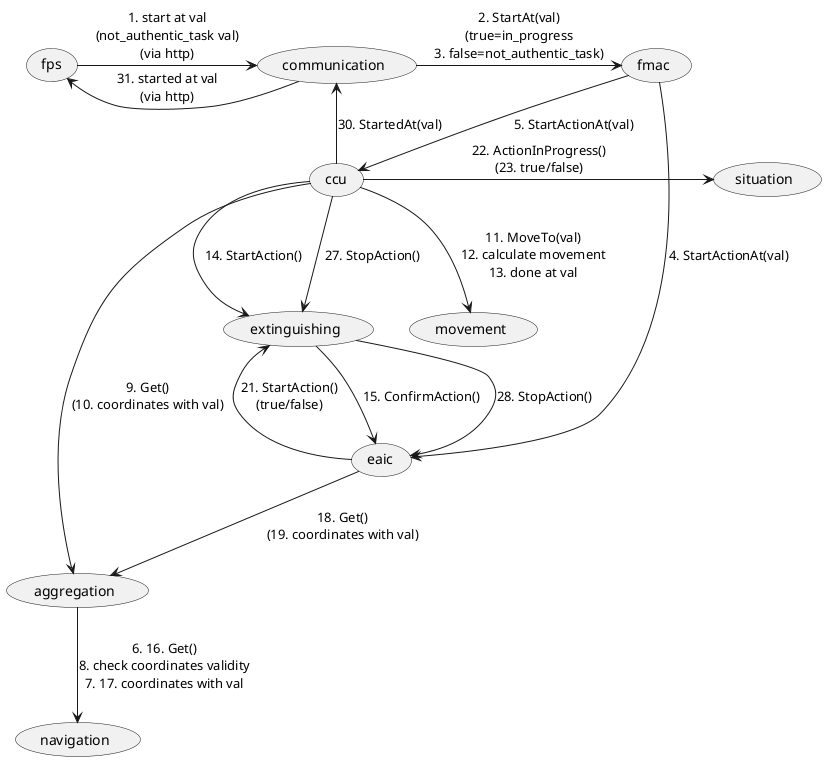

# Developer notes

- [Terms and progress](#terms-and-progress)
- [Communications](#communications)
- [Protocol](#Protocol)
- [Logic](#logic-from-plantuml)
- [Logic with pseudocode](#logic-with-pseudocode)
- [Dev Plan log](#dev-plan-log)

## Terms and progress:
- [ ] Aggregation - Комплексирование
- [ ] CCU (Central control unit) - Центральная система управления
- [ ] Communication - Связь
- [ ] Extinguishing - Процедура тушения
- [ ] EAIC (extinguishing and ignition circuits controller) - Контроль активации цепей тушения и поджига
- [ ] FMAC (Flight mission authenticity control) - Контроль аутентичности полётного задания
- [ ] FPS (Flight Plan Server) - Источник полётного задания
- [ ] Movement control - Управление перемещением
- [ ] Navigation system - Навигация GNSS + ИНС
- [ ] Situation control - Контроль обстановки

## Interface
 - FPS is listening on 8081 port, so accessible via http://localhost:8081

## Communications:
 - all modules have public interfaces accessible via IPC (except FPS)
   - IPC requests go straight to a module (via KSM, but this is transparent)
 - `einit/src/*.psl` files are describe allowed actions (everything blocked by default)
 
## Protocol:
  - mostly KOS IPC in use with an exception for fps <-> communication, becase fps is an external service.
    - idl files are describe interfaces accessibla via IPC with in/out parameters.
  - for fps <-> communication simple GET/POST requests are in use

### Interconnection and allowed communications



## Logic (from plantuml):
```
fps -> communication
  1. start extinguishing at A
communication -> fmac
  2. start extinguishing at A
fmac
  3. Authentic task check
fmac -> eaic
  4. execute extinguishing at A
fmac -> ccu
  5. execute extinguishing at A
aggregation -> navigation
  6. get coordinates
navigation -> aggregation
  7. return coordinates
aggregation
  8. check coordinates validity
ccu -> aggregation
  9. get coordinates
aggregation -> ccu
 10. coordinates
ccu -> movement
 11. move to A
movement
 12. calculate movement
movement -> ccu
 13. move to A done
ccu -> extinguishing
 14. start extinguish/fire
extinguishing -> eaic
 15. extinguishing request
aggregation -> navigation
 16. get coordinates
navigation -> aggregation
 17. return coordinates
eaic -> aggregation
 18. get coordinates
aggregation -> eaic
 19. coordinates and time
eaic
 20. check if extinguishing/fire at this place (A) is allowed
eaic -> extinguishing
 21. activate extinguishing/fire
extinguishing
 22. proceed extinguishing/fire
eaic
 23. position control
ccu -> situation
 24. check if algo is running
situation
 25. check if extinguishing is running
situation -> ccu
 26. extinguishing is running
ccu -> extinguishing
 27. stop algo extinguishing
extinguishing -> eaic
 28. stop
eaic
 29. disable extinguishing/fire
ccu -> communication
 30. extinguishing/fire at A has been started
communication -> fps
 31. extinguishing/fire at A has been started
```

## Logic with pseudocode:
### [ ] Aggregation - Комплексирование
```
aggregation -> navigation
- pub  6. get coordinates
navigation -> aggregation
- sub  7. return coordinates
aggregation
- pub  8. check coordinates validity
ccu -> aggregation
- sub  9. get_coordinates
aggregation -> ccu
- pub 10. coordinates
aggregation -> navigation
- pub 16. get coordinates
navigation -> aggregation
- sub 17. return coordinates
eaic -> aggregation
- sub 18. get coordinates
aggregation -> eaic
- pub 19. coordinates and time
```
```
export aggregation GetCoordinates
        return coordinates{var_gps, var_ins}
loop:
    request navigation GetCoordinates
    response (var_gps, var_ins)
        check_coordinates_validity(var_gps, var_ins)
        save coordinates{var_gps, var_ins}
```

### [ ] CCU (Central control unit) - Центральная система управления
```
fmac -> ccu
- sub  5. execute extinguishing at A
ccu -> aggregation
- pub  9. get coordinates
aggregation -> ccu
- sub 10. coordinates
ccu -> movement
- pub 11. move to A
movement -> ccu
- sub 13. move to A done
ccu -> extinguishing
- pub 14. start extinguish/fire
ccu -> situation
- pub 24. check if algo is running
situation -> ccu
- sub 26. extinguishing is running
ccu -> extinguishing
- pub 27. stop algo extinguishing
ccu -> communication
- pub 30. extinguishing/fire at A has been started
```
```
public StartActionAt(var): // 5
    request aggregation GetCoordinates // 9, 10
    if(request movement MoveTo(var)): // 11, 13
        request extinguishing StartAction // 14

public StartedAt(var): // 26
    request communication StartedAt(var): // 30
    return true // 27

loop:
    request situation ActionInProgress // 24

```

### [ ] Communication - Связь
```
fps -> communication
- sub  1. start extinguishing at A
communication -> fmac
- pub  2. start extinguishing at A
ccu -> communication
- sub 30. extinguishing/fire at A has been started
communication -> fps
- pub 31. extinguishing/fire at A has been started
```
```
listen
    if start at val
        request fmac StartAt(var) // true/false
            if false:
                send fps not_authentic_task at var

export StartedAt(var): // for ccu
    send fps started at var
    return true // or empty
```

### [ ] Extinguishing - Процедура тушения
```
ccu -> extinguishing
- sub 14. start extinguish/fire
extinguishing -> eaic
- pub 15. extinguishing request
eaic -> extinguishing
- sub 21. activate extinguishing/fire
extinguishing
- private 22. proceed extinguishing/fire
ccu -> extinguishing
- sub 27. stop algo extinguishing
extinguishing -> eaic
- pub 28. stop
```
```
ProceedAction():
    sleep(10) // imitate load

export StartAction(): // for ccu
    request eaic ConfirmAction() // true/false
        if true:
            InAction = true
            ProceedAction()
export StopAction(): // for ccu
    request eaic StopAction() // true/false
    InAction = false;
```

### [ ] EAIC (extinguishing and ignition circuits controller) - Контроль активации цепей тушения и поджига
```
fmac -> eaic
- sub  4. execute extinguishing at A
extinguishing -> eaic
- sub 15. extinguishing request
eaic -> aggregation
- pub 18. get coordinates
aggregation -> eaic
- sub 19. coordinates and time
eaic
- private 20. check if extinguishing/fire at this place (A) is allowed
eaic -> extinguishing
- pub 21. activate extinguishing/fire
eaic
- private 23. position control
extinguishing -> eaic
- sub 28. stop
eaic
- private 29. disable extinguishing/fire
```
```
export StartActionAt(var) // 4
    task = var

export ConfirmAction: // 15
    send aggregation GetCoordinates // 18
    ActionIsAllowed(task) // 20, 21
    in_progress = true
    return true // StartAction 21 

export StopAction: //28
    in_progress = false
    task = ""

PositionControl(): // 23
    while(1):
        if in_progress:
            print "position control" // 23
            sleep(1)
```

### [ ] FMAC (Flight mission authenticity control) - Контроль аутентичности полётного задания
```
communication -> fmac
- sub  2. start extinguishing at A
fmac
- private  3. Authentic task check
fmac -> eaic
- pub  4. execute extinguishing at A
fmac -> ccu
- pub  5. execute extinguishing at A
```
```
export StartAt(var):
    if(authentic_task_check(var)):
        request eaic ExecuteAt(var)
        request ccu ExecuteAt(var)
        return true
    else:
        return false // not authentic
```

### [ ] FPS (Flight Plan Server) - Источник полётного задания
```
fps -> communication
pub  1. start extinguishing at A
communication -> fps
sub 31. extinguishing/fire at A has been started
```
```
listen // for commands and an interchange data with the communication
    if started at val
        send client started at val // via web interface
    if start at val
        send communication start at val
    if not_authentic_task at val
        send client not_authentic_task at val
```

### [ ] Movement control - Управление перемещением
```
ccu -> movement
- sub 11. move to A
movement
- private 12. calculate movement
movement -> ccu
- pub 13. move to A done
```
```
export movement MoveTo(val):
    calculate_movement(val)
    return true
```

### [ ] Navigation system - Навигация GNSS + ИНС
```
aggregation -> navigation
- sub 6. get_coordinates
navigation -> aggregation
- pub  7. return coordinates
aggregation -> navigation
- sub 16. get_coordinates
navigation -> aggregation
- pub 17. return coordinates
```
```
export navigation GetCoordinates:
    return coordinates{var_gps, var_ins}
```

### [ ] Situation control - Контроль обстановки
```
ccu -> situation
 24. check if algo is running
situation
 25. check if extinguishing is running
situation -> ccu
 26. extinguishing is running
ccu -> situation
```
```
public ActionInProgress:
    if is_action_running
        return true
    else:
        return false
```
## Dev Plan log:
Day 1 Dec 14
- Reading KOS docs and experimenting

Day 2 Dec 15
- Reading KOS docs and experimenting

Day 3 Dec 16
- Reading KOS docs and experimenting

Day 4 Dec 18
- Some understanding about IPC

Day 5 Dec 19
- [x] Aggregation + Navigation modules simple implementation

Day 6 Dec 20
- [x] ksm logger (improve filtering)
- [x] Situation
- [x] Figure out how to deal with several processes

Day 7 Dec 21
- Thinking

Day 8 Dec 22
- [x] Logic in this document updated for kos and ipc
- [ ] Implement and test communication module
